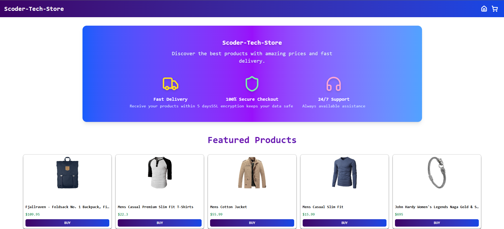

# Scoder-Tech-Store

# React + Vite + TypeScript

This is a simple e-commerce application built with React, Vite, TypeScript, and Tailwind CSS, using the FakeStoreAPI to display products, categories, and simulate a shopping cart.

✨ Features

- Dynamic product listing and removal

- Interactive shopping cart

- Modern, responsive design with Tailwind CSS

🛠️ Technologies

- ⚛️ React

- ⚡ Vite (fast build tool)

- 📜 TypeScript (static typing)

- 🎨 Tailwind CSS (styling)

- 📦 FakeStoreAPI (product data)

- 🤖 v0 by Vercel (A.I.)

🔗 Live Demo
👉 https://product-catalog-rose-five.vercel.app
